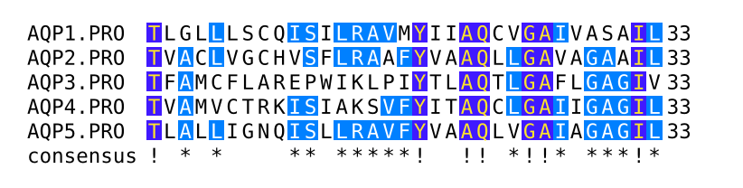

# Typshade



Typst-native multiple-sequence alignment figures for bioinformatics.

Typshade is an independent Typst-native implementation inspired by Eric
Beitz's TeXshade package. If your publication relies on TeXshade-compatible
alignment shading or labeling behavior, please cite: Eric Beitz (2000),
TeXshade: shading and labeling multiple sequence alignments using LaTeX 2e.
Bioinformatics 16, 135-139.

## Why Typshade?

TeXshade is powerful, but its source often becomes a long order-sensitive
command stream. Typshade keeps the same figure-building ideas while using
Typst data structures, named arguments, and reusable helpers.

TeXshade style:

```latex
\begin{texshade}{alignment.msf}
  \shadingmode[similar]{identical}
  \shadingcolors{blues}
  \residuesperline{45}
  \showruler{top}{1}
  \showconsensus{bottom}
  \shaderegion{1}{NPA}{White}{BrickRed}
\end{texshade}
```

Typshade style:

```typst
#let alignment = read("alignment.msf", encoding: none)

#shade(
  alignment,
  format: "msf",
  figure: publication(
    similarity: "blues",
    region: "80..125",
    logo: "charge",
    motifs: (
      "NPA": (bg: "BrickRed", text: "active site"),
      "NXX[ST]N": "motif",
    ),
  ),
)
```

The `figure:` recipe keeps the source close to the scientific intent, so the
document reads like a figure specification rather than a log of setup commands.

## Quick Start

```typst
#import "@preview/typshade:0.1.0": *

#let alignment = read("alignment.msf", encoding: none)

#shade(
  alignment,
  format: "msf",
  theme: "screen",
  figure: motif-map(auto),
)
```

## Preview

Protein alignment with conservation shading and motif annotation:


Nucleotide alignment with DNA coloring:


## TeXshade To Typshade

| TeXshade idea | Typshade API |
|---|---|
| `texshade` environment | `shade(read("alignment.msf", encoding: none), format: "msf", figure: publication(...))` |
| `shadingmode`, `shadingcolors`, `threshold` | `similar`, `identical`, `diverse`, `functional`, or `scoring-mode`, `color-scheme`, `threshold` |
| `residuesperline`, `setends` | `lines`, `window`, or `residues-per-line`, `sequence-window` |
| `shownames`, `shownumbering`, `showconsensus`, `showruler` | `names`, `numbers`, `consensus`, `ruler`, or fine-grained track helpers |
| `showsequencelogo`, `showsubfamilylogo`, `showlegend` | `logo`, `subfamily-logo`, `legend` |
| `shaderegion`, `tintregion`, `emphregion`, `feature` | `highlight`, `tint`, `emphasize`, `mark`, `motif`, `graph` |
| `includeDSSP`, `includeSTRIDE`, `includeHMMTOP`, `includePHD*` | `structure-tracks`, `dssp-track`, `stride-track`, `hmmtop-track`, `phd-topology-track`, `phd-secondary-track` |
| font and spacing macros | `text-family`, `text-weight`, `text-posture`, `text-size`, `block-gap`, `feature-slot-space` |

The public entrypoint is `lib.typ`. Internal implementation files live under
`internal/` and are grouped by responsibility:

Public documents should normally use `shade(..., figure: (...))` with recipes
such as `publication`, `motif-map`, `structure-map`, `logo-analysis`, and
`overview`.

Recipes inspect the alignment before rendering, so `motif-map(auto)` can detect
common motifs, focus the region, choose line length, and enable readable tracks.

For custom figures, pass helper lists through `commands:`. Helpers such as
`similar`, `lines`, `ruler`, `consensus`, `logo`, `highlight`, `motif`, and
`graph` remain available without adding another top-level API slot.

Inspection and analysis helpers such as `alignment-summary`, `selection-table`,
`percent-identity`, `percent-similarity`, and `similarity-table` can be used in
documents and reports without relying on TeX log output.

For detailed control, use Typst-shaped command helpers such as `threshold`,
`weight-table`, `set-weight`, `residue-style`, `names-track`,
`numbering-track`, `consensus-symbols`, `ruler-marker`, `logo-color`,
`sequence-length`, `feature-rule`, `structure-appearance`, `text-family`,
`block-gap`, and `feature-slot-space`. Macro-style command names are
intentionally not part of the public API.

- `interface/`: public-facing helpers such as `shade`, presets, annotations, and inspection.
- `engine/`: configuration records, command application, and layout selection.
- `render/`: alignment, logo, feature, and graph rendering.
- `model/`: parsing, palettes, sequence/logo math, PDB helpers, and text styling.

# License

This project is distributed under the GPL v2 License. See [LICENSE](LICENSE) for details.
